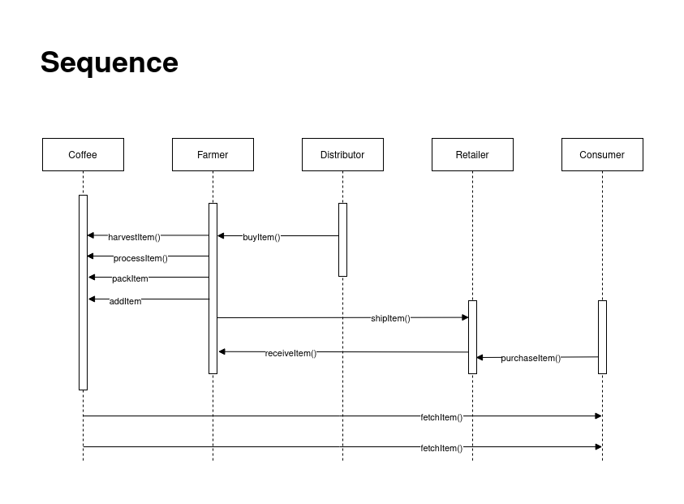
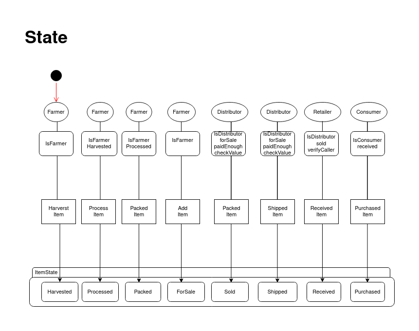
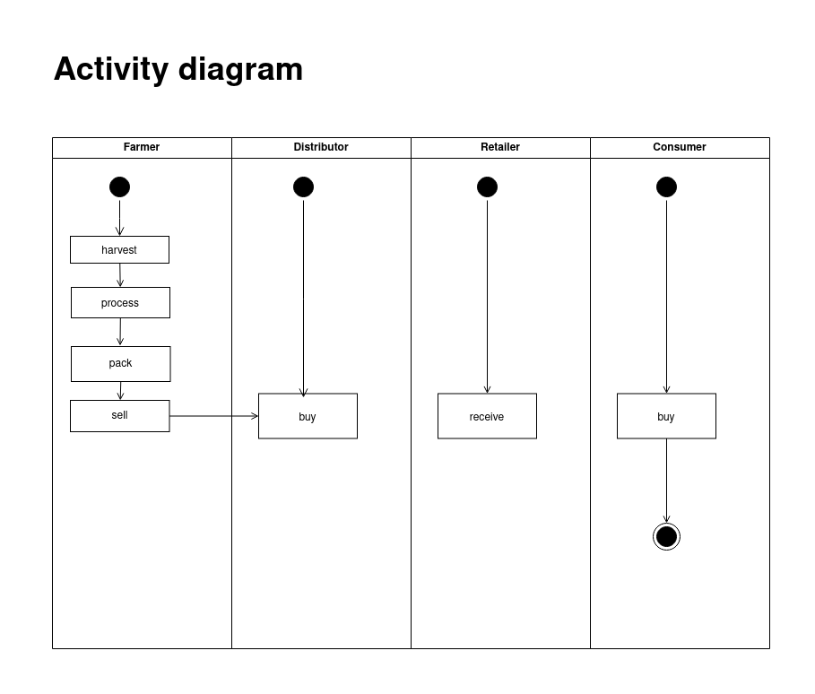
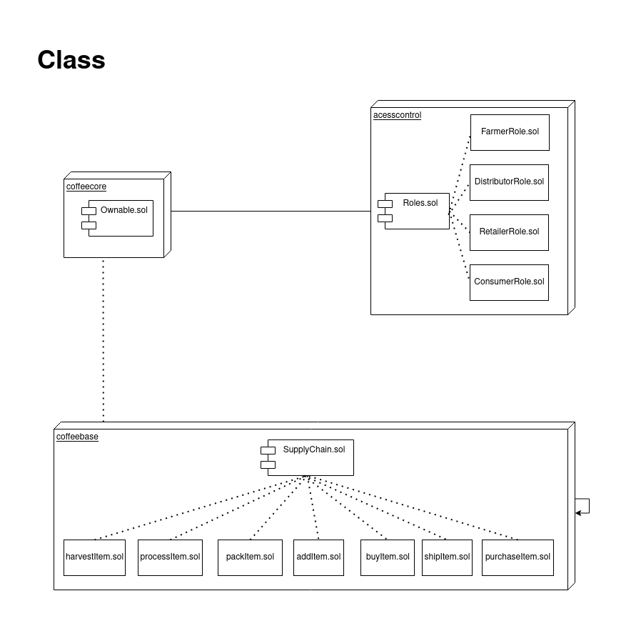

# Supply chain & data auditing

This repository containts an Ethereum DApp that demonstrates a Supply Chain flow between a Seller and Buyer. The user story is similar to any commonly used supply chain process. A Seller can add items to the inventory system stored in the blockchain. A Buyer can purchase such items from the inventory system. Additionally a Seller can mark an item as Shipped, and similarly a Buyer can mark an item as Received.

The DApp User Interface when running should look like...


# UML











## Getting Started

These instructions will get you a copy of the project up and running on your local machine for development and testing purposes. See deployment for notes on how to deploy the project on a live system.

### Prerequisites

Please make sure you've already installed ganache-cli, Truffle and enabled MetaMask extension in your browser.

```
Give examples (to be clarified)
```

### Installing

> The starter code is written for **Solidity v0.4.24**. At the time of writing, the current Truffle v5 comes with Solidity v0.5 that requires function *mutability* and *visibility* to be specified (please refer to Solidity [documentation](https://docs.soliditylang.org/en/v0.5.0/050-breaking-changes.html) for more details). To use this starter code, please run `npm i -g truffle@4.1.14` to install Truffle v4 with Solidity v0.4.24. 

A step by step series of examples that tell you have to get a development env running

Clone this repository:

```
git clone https://github.com/udacity/nd1309/tree/master/course-5/project-6
```

Change directory to ```project-6``` folder and install all requisite npm packages (as listed in ```package.json```):

```
cd project-6
npm install
```

Launch Ganache:

```
ganache-cli -m "spirit supply whale amount human item harsh scare congress discover talent hamster"
```

Your terminal should look something like this:


In a separate terminal window, Compile smart contracts:

```
truffle compile
```

Your terminal should look something like this:


This will create the smart contract artifacts in folder ```build\contracts```.

Migrate smart contracts to the locally running blockchain, ganache-cli:

```
truffle migrate
```

Your terminal should look something like this:


truffle migrate --reset --network goerli

Compiling your contracts...
===========================
> Everything is up to date, there is nothing to compile.


Migrations dry-run (simulation)
===============================
> Network name:    'goerli-fork'
> Network id:      5
> Block gas limit: 30000000 (0x1c9c380)


1_initial_migration.js
======================

   Deploying 'Migrations'
   ----------------------
   > block number:        8054703
   > block timestamp:     1669903291
   > account:             0x70523D6f32Ad8d75a8202d5c08d3AD1E5E6c5E38
   > balance:             0.232948366808143473
   > gas used:            239894 (0x3a916)
   > gas price:           2.500000308 gwei
   > value sent:          0 ETH
   > total cost:          0.000599735073887352 ETH

   -------------------------------------
   > Total cost:     0.000599735073887352 ETH


2_deploy_contracts.js
=====================

   Deploying 'FarmerRole'
   ----------------------
   > block number:        8054705
   > block timestamp:     1669903295
   > account:             0x70523D6f32Ad8d75a8202d5c08d3AD1E5E6c5E38
   > balance:             0.232047974220916423
   > gas used:            314409 (0x4cc29)
   > gas price:           2.500000238 gwei
   > value sent:          0 ETH
   > total cost:          0.000786022574829342 ETH


   Deploying 'DistributorRole'
   ---------------------------
   > block number:        8054706
   > block timestamp:     1669903299
   > account:             0x70523D6f32Ad8d75a8202d5c08d3AD1E5E6c5E38
   > balance:             0.231261921655202434
   > gas used:            314421 (0x4cc35)
   > gas price:           2.500000209 gwei
   > value sent:          0 ETH
   > total cost:          0.000786052565713989 ETH


   Deploying 'RetailerRole'
   ------------------------
   > block number:        8054707
   > block timestamp:     1669903302
   > account:             0x70523D6f32Ad8d75a8202d5c08d3AD1E5E6c5E38
   > balance:             0.230475809097344554
   > gas used:            314445 (0x4cc4d)
   > gas price:           2.500000184 gwei
   > value sent:          0 ETH
   > total cost:          0.00078611255785788 ETH


   Deploying 'ConsumerRole'
   ------------------------
   > block number:        8054708
   > block timestamp:     1669903305
   > account:             0x70523D6f32Ad8d75a8202d5c08d3AD1E5E6c5E38
   > balance:             0.229689756546408352
   > gas used:            314421 (0x4cc35)
   > gas price:           2.500000162 gwei
   > value sent:          0 ETH
   > total cost:          0.000786052550936202 ETH


   Deploying 'SupplyChain'
   -----------------------
   > block number:        8054709
   > block timestamp:     1669903316
   > account:             0x70523D6f32Ad8d75a8202d5c08d3AD1E5E6c5E38
   > balance:             0.223245038677770511
   > gas used:            2577887 (0x2755df)
   > gas price:           2.500000143 gwei
   > value sent:          0 ETH
   > total cost:          0.006444717868637841 ETH

   -------------------------------------
   > Total cost:     0.009588958117975254 ETH

Summary
=======
> Total deployments:   6
> Final cost:          0.010188693191862606 ETH


Starting migrations...
======================
> Network name:    'goerli'
> Network id:      5
> Block gas limit: 30000000 (0x1c9c380)


1_initial_migration.js
======================

   Deploying 'Migrations'
   ----------------------
   > transaction hash:    0xf1ec614e9621dc4ff163de809665b5fd1bc751f388fbef8043c8a40f515d1a2d
   > Blocks: 2            Seconds: 21
   > contract address:    0x7AAEF08ab3C95c113115e5b80e9D9Ca829e12741
   > block number:        8054712
   > block timestamp:     1669903344
   > account:             0x70523D6f32Ad8d75a8202d5c08d3AD1E5E6c5E38
   > balance:             0.232948366816539763
   > gas used:            239894 (0x3a916)
   > gas price:           2.500000273 gwei
   > value sent:          0 ETH
   > total cost:          0.000599735065491062 ETH

   > Saving migration to chain.
   > Saving artifacts
   -------------------------------------
   > Total cost:     0.000599735065491062 ETH


2_deploy_contracts.js
=====================

   Deploying 'FarmerRole'
   ----------------------
   > transaction hash:    0xdfb1ebfd3ec8bb8221363462038137ed47454223c007a72b40de49adf1012ca7
   > Blocks: 2            Seconds: 25
   > contract address:    0x7f1dbCBA2D723e72D6641D079940932CB294113F
   > block number:        8054717
   > block timestamp:     1669903416
   > account:             0x70523D6f32Ad8d75a8202d5c08d3AD1E5E6c5E38
   > balance:             0.232047974217874226
   > gas used:            314409 (0x4cc29)
   > gas price:           2.500000277 gwei
   > value sent:          0 ETH
   > total cost:          0.000786022587091293 ETH


   Deploying 'DistributorRole'
   ---------------------------
   > transaction hash:    0x28a9409e19a52a923e47b051fbbc69d5675df94d5ceb68d9d8c079fc60119769
   > Blocks: 2            Seconds: 13
   > contract address:    0xa84fBc9Cc4D832EFc3722D0fd1Fc93929FccfEC0
   > block number:        8054719
   > block timestamp:     1669903440
   > account:             0x70523D6f32Ad8d75a8202d5c08d3AD1E5E6c5E38
   > balance:             0.231261921635495924
   > gas used:            314421 (0x4cc35)
   > gas price:           2.500000262 gwei
   > value sent:          0 ETH
   > total cost:          0.000786052582378302 ETH


   Deploying 'RetailerRole'
   ------------------------
   > transaction hash:    0xacd39c0f19cee55fe054fdf943023a7abe8b50fe79e8e599be901e5060d388be
   > Blocks: 1            Seconds: 17
   > contract address:    0x86c4559e1AeE9bf2b2e52A7C985ae906531dc72A
   > block number:        8054720
   > block timestamp:     1669903464
   > account:             0x70523D6f32Ad8d75a8202d5c08d3AD1E5E6c5E38
   > balance:             0.230475809059714679
   > gas used:            314445 (0x4cc4d)
   > gas price:           2.500000241 gwei
   > value sent:          0 ETH
   > total cost:          0.000786112575781245 ETH


   Deploying 'ConsumerRole'
   ------------------------
   > transaction hash:    0x64adfc78ea718aa36f5619cb286f27e77c32bf62865a866a6b3fff35243f5ab6
   > Blocks: 3            Seconds: 37
   > contract address:    0x1cdfDa0b73f4781AF32F8333C36F8bC6Cbd5e253
   > block number:        8054724
   > block timestamp:     1669903512
   > account:             0x70523D6f32Ad8d75a8202d5c08d3AD1E5E6c5E38
   > balance:             0.229689756482995955
   > gas used:            314421 (0x4cc35)
   > gas price:           2.500000244 gwei
   > value sent:          0 ETH
   > total cost:          0.000786052576718724 ETH


   Deploying 'SupplyChain'
   -----------------------
   > transaction hash:    0x375a7b114286d4bada9d6247879cdfea7e0f45cfa6f8cd83d7a34299cd4f78bb
   > Blocks: 2            Seconds: 18
   > contract address:    0x0DDF1E73c1052d0f4b65954C3ef8779A43f57865
   > block number:        8054726
   > block timestamp:     1669903536
   > account:             0x70523D6f32Ad8d75a8202d5c08d3AD1E5E6c5E38
   > balance:             0.223245038335946318
   > gas used:            2577887 (0x2755df)
   > gas price:           2.500000251 gwei
   > value sent:          0 ETH
   > total cost:          0.006444718147049637 ETH

   > Saving migration to chain.
   > Saving artifacts
   -------------------------------------
   > Total cost:     0.009588958469019201 ETH

Summary
=======
> Total deployments:   6
> Final cost:          0.010188693534510263 ETH


Test smart contracts:

```
truffle test
```

All 10 tests should pass.


In a separate terminal window, launch the DApp:

```
npm run dev
```

## Built With

* [Ethereum](https://www.ethereum.org/) - Ethereum is a decentralized platform that runs smart contracts
* [IPFS](https://ipfs.io/) - IPFS is the Distributed Web | A peer-to-peer hypermedia protocol
to make the web faster, safer, and more open.
* [Truffle Framework](http://truffleframework.com/) - Truffle is the most popular development framework for Ethereum with a mission to make your life a whole lot easier.


## Authors

See also the list of [contributors](https://github.com/your/project/contributors.md) who participated in this project.


## RinkeBy Network
> Transaction ID:  0x375a7b114286d4bada9d6247879cdfea7e0f45cfa6f8cd83d7a34299cd4f78bb
> contract address:    0x0DDF1E73c1052d0f4b65954C3ef8779A43f57865

## Acknowledgments
* Solidity 0.4.24
* web3 1.5.2
* Ganache-cli v6.12.2(ganache-core: 2.13.2)
* Truffle v4.1.14
* truffle-hdwallet-provider 1.0.17
